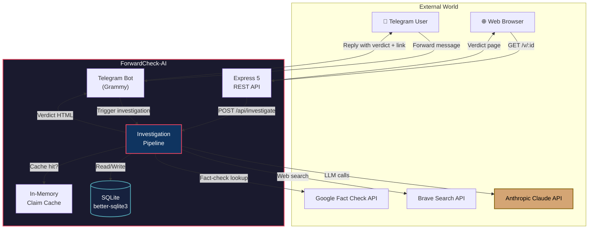
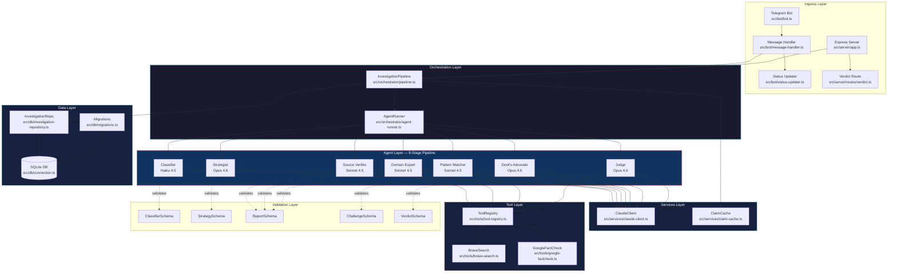
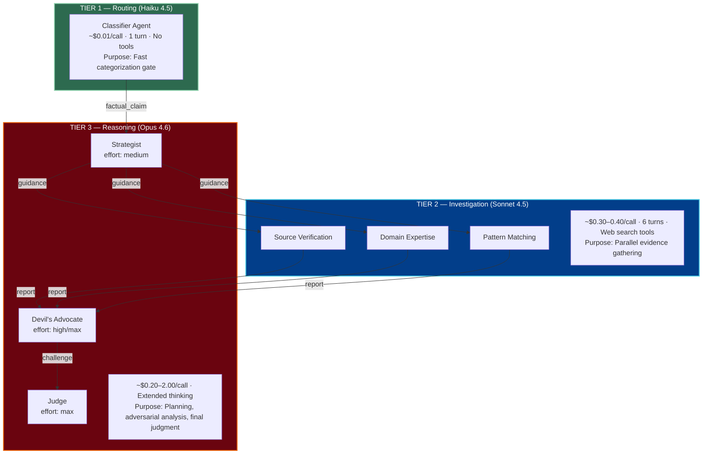
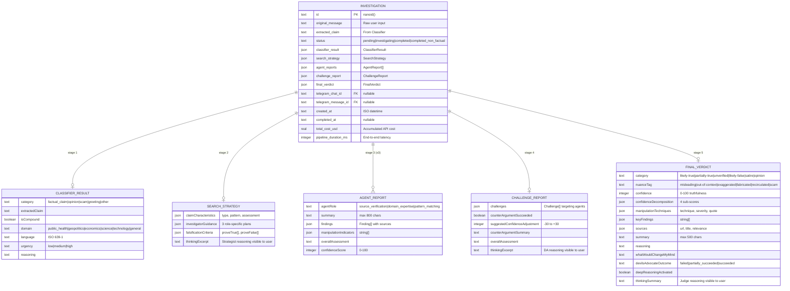
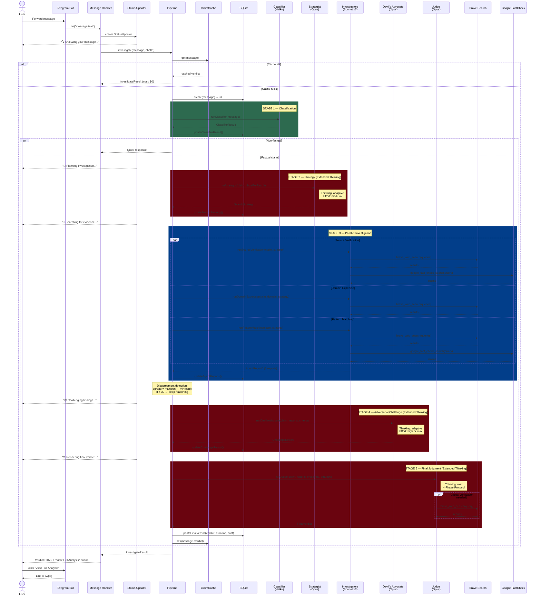
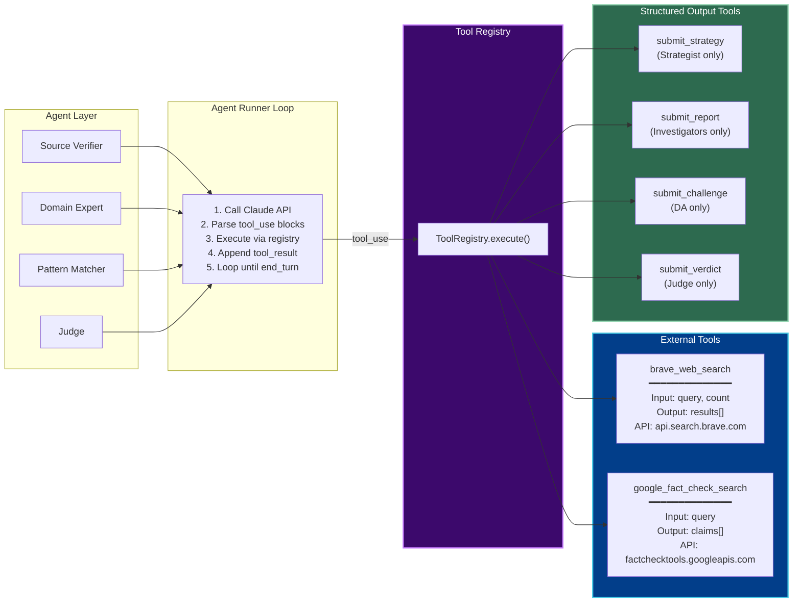
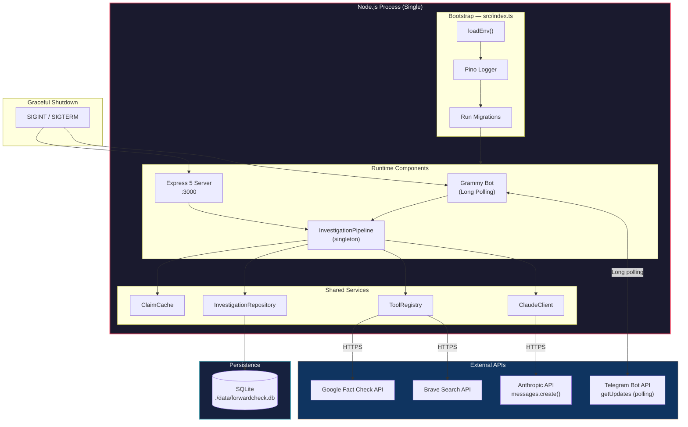
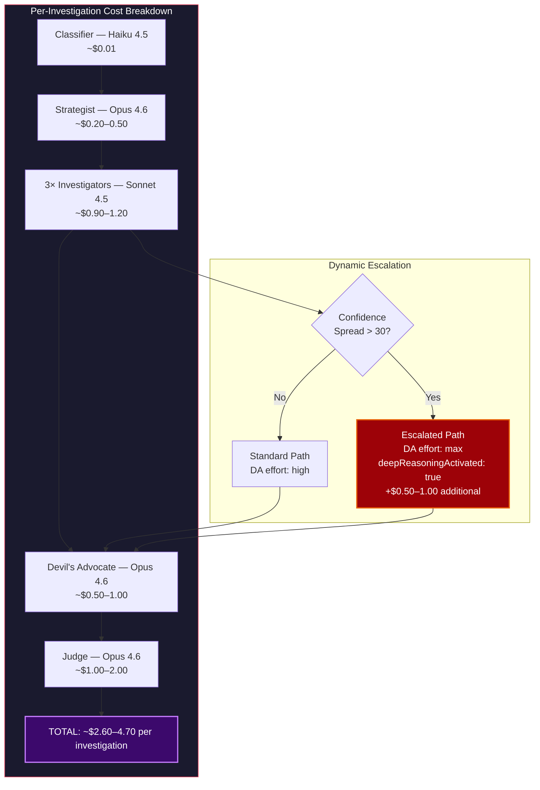
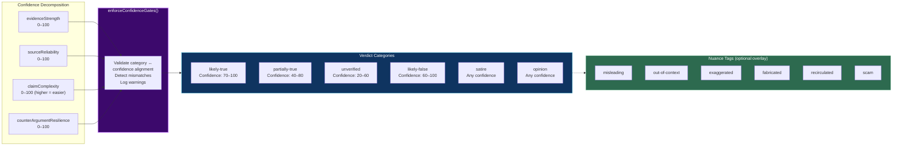

# ForwardCheck-AI — System Architecture

> Multi-agent fact-checking pipeline built with Claude Opus 4.6

---

## 1. System Context Diagram

---

## 2. High-Level Component Architecture

---

## 3. Agent Pipeline — Data Flow

```mermaid
flowchart TD
    MSG["📨 Incoming Message"] --> CACHE{"Cache<br/>Hit?"}
    CACHE -->|"Yes"| CACHED["Return Cached Verdict<br/>Cost: $0.00"]
    CACHE -->|"No"| CL

    CL["🏷️ CLASSIFIER<br/>━━━━━━━━━━━━━━<br/>Model: Haiku 4.5<br/>Turns: 1 · No tools<br/>Cost: ~$0.01<br/>━━━━━━━━━━━━━━<br/>→ category, domain,<br/>  extractedClaim,<br/>  urgency"]

    CL -->|"opinion / scam /<br/>greeting / other"| NF["Quick Response<br/>(No investigation)"]
    CL -->|"factual_claim"| ST

    ST["🧠 STRATEGIST<br/>━━━━━━━━━━━━━━<br/>Model: Opus 4.6 ★<br/>Turns: 1 · Thinking: adaptive<br/>Cost: ~$0.20–0.50<br/>━━━━━━━━━━━━━━<br/>→ SearchStrategy:<br/>  claimCharacteristics,<br/>  investigatorGuidance,<br/>  falsificationCriteria"]

    ST --> PAR

    subgraph PAR["⚡ PARALLEL INVESTIGATION — Promise.allSettled()"]
        direction LR
        SV["🔍 SOURCE VERIFIER<br/>━━━━━━━━━━━━━━━━<br/>Sonnet 4.5 · 6 turns<br/>Tools: brave, factcheck<br/>~$0.30–0.40<br/>━━━━━━━━━━━━━━━━<br/>Find origins,<br/>verify credibility,<br/>locate debunks"]

        DE["🎓 DOMAIN EXPERT<br/>━━━━━━━━━━━━━━━━<br/>Sonnet 4.5 · 6 turns<br/>Tools: brave, factcheck<br/>~$0.30–0.40<br/>━━━━━━━━━━━━━━━━<br/>Check accuracy via<br/>authoritative sources<br/>for specific domain"]

        PM["🔄 PATTERN MATCHER<br/>━━━━━━━━━━━━━━━━<br/>Sonnet 4.5 · 6 turns<br/>Tools: brave, factcheck<br/>~$0.30–0.40<br/>━━━━━━━━━━━━━━━━<br/>Search Snopes,<br/>PolitiFact; ID<br/>misinfo patterns"]
    end

    PAR --> AGG["Aggregate AgentReports[]<br/>Compute confidence spread"]
    AGG --> DISAGREE{"Spread<br/>> 30?"}
    DISAGREE -->|"Yes"| DEEP["🔴 Deep Reasoning<br/>DA effort → max"]
    DISAGREE -->|"No"| NORMAL["DA effort → high"]
    DEEP --> DAV
    NORMAL --> DAV

    DAV["😈 DEVIL'S ADVOCATE<br/>━━━━━━━━━━━━━━━━━━<br/>Model: Opus 4.6 ★<br/>Turns: 1 · Thinking: adaptive<br/>Effort: high or max<br/>Cost: ~$0.50–1.00<br/>━━━━━━━━━━━━━━━━━━<br/>→ ChallengeReport:<br/>  challenges[],<br/>  counterArgumentSucceeded,<br/>  confidenceAdjustment"]

    DAV --> JDG

    JDG["⚖️ JUDGE<br/>━━━━━━━━━━━━━━━━━━<br/>Model: Opus 4.6 ★<br/>Turns: 5 max · Thinking: max<br/>Tools: brave (critical verify)<br/>Cost: ~$1.00–2.00<br/>━━━━━━━━━━━━━━━━━━<br/>4-Phase Protocol:<br/>1. Strategize<br/>2. Synthesize<br/>3. Evaluate<br/>4. Verdict"]

    JDG --> VERDICT

    VERDICT["📋 FINAL VERDICT<br/>━━━━━━━━━━━━━━━━<br/>category · confidence<br/>confidenceDecomposition<br/>keyFindings · sources<br/>manipulationTechniques<br/>devilsAdvocateOutcome<br/>whatWouldChangeMyMind"]

    VERDICT --> FMT["Format & Gate"]
    FMT --> OUT1["💬 Telegram Reply<br/>(HTML + View Full Analysis link)"]
    FMT --> OUT2["🌐 Web Verdict Page<br/>/v/:investigationId"]
    FMT --> STORE["💾 SQLite + Cache"]

    style CL fill:#2d6a4f,stroke:#95d5b2,stroke-width:2px,color:#fff
    style ST fill:#6a040f,stroke:#e85d04,stroke-width:2px,color:#fff
    style SV fill:#023e8a,stroke:#48cae4,stroke-width:2px,color:#fff
    style DE fill:#023e8a,stroke:#48cae4,stroke-width:2px,color:#fff
    style PM fill:#023e8a,stroke:#48cae4,stroke-width:2px,color:#fff
    style DAV fill:#6a040f,stroke:#e85d04,stroke-width:2px,color:#fff
    style JDG fill:#6a040f,stroke:#e85d04,stroke-width:2px,color:#fff
    style VERDICT fill:#3c096c,stroke:#c77dff,stroke-width:2px,color:#fff
    style PAR fill:#001d3d,stroke:#48cae4,stroke-width:1px,color:#fff
    style DEEP fill:#9d0208,stroke:#e85d04,stroke-width:2px,color:#fff
```

---

## 4. Three-Tier Model Strategy

---

## 5. Data Model — Entity Relationships

---

## 6. Sequence Diagram — Full Investigation Lifecycle

---

## 7. Tool Dispatch Architecture

---

## 8. Deployment & Runtime Architecture

---

## 9. Cost Model & Escalation Path

---

## 10. Confidence Gate & Verdict Category Matrix

---

## File Map

| Layer | Key Files | Responsibility |
|-------|-----------|----------------|
| **Entry** | `src/index.ts` | Bootstrap, wire dependencies, start services |
| **Bot** | `src/bot/bot.ts`, `message-handler.ts`, `status-updater.ts` | Telegram I/O, progress feedback |
| **API** | `src/server/app.ts`, `routes/verdict.ts` | REST endpoints, verdict web pages |
| **Pipeline** | `src/orchestrator/pipeline.ts` | End-to-end investigation orchestration |
| **Runner** | `src/orchestrator/agent-runner.ts` | Generic agent execution loop with timeout |
| **Agents** | `src/agents/classifier-agent.ts` | Haiku — fast routing |
| | `src/agents/strategist-agent.ts` | Opus — investigation planning |
| | `src/agents/investigators/source-verification-agent.ts` | Sonnet — origin & credibility |
| | `src/agents/investigators/domain-expertise-agent.ts` | Sonnet — domain-specific accuracy |
| | `src/agents/investigators/pattern-matching-agent.ts` | Sonnet — known misinfo patterns |
| | `src/agents/devils-advocate-agent.ts` | Opus — adversarial red-teaming |
| | `src/agents/judge-agent.ts` | Opus — final synthesis & verdict |
| **Services** | `src/services/claude-client.ts` | Anthropic SDK wrapper with cost tracking |
| | `src/services/claim-cache.ts` | In-memory dedup cache |
| **Tools** | `src/tools/tool-registry.ts`, `brave-search.ts`, `google-factcheck.ts` | External search dispatch |
| **Data** | `src/db/connection.ts`, `migrations.ts`, `investigation-repository.ts` | SQLite persistence |
| **Schemas** | `src/schemas/*.ts` | Zod validation for all agent outputs |
| **Formatter** | `src/formatter/telegram-formatter.ts` | HTML output, confidence gates |
| **Config** | `src/config/env.ts`, `logger.ts` | Environment, structured logging |
