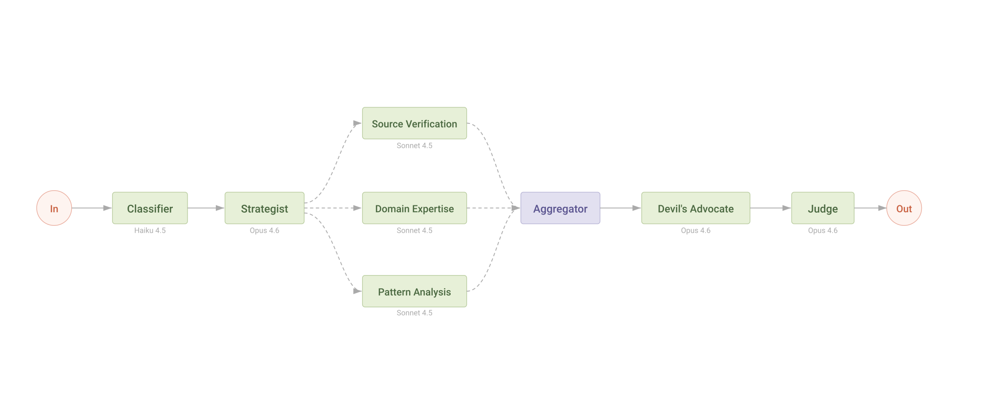
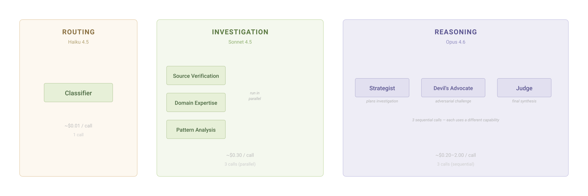
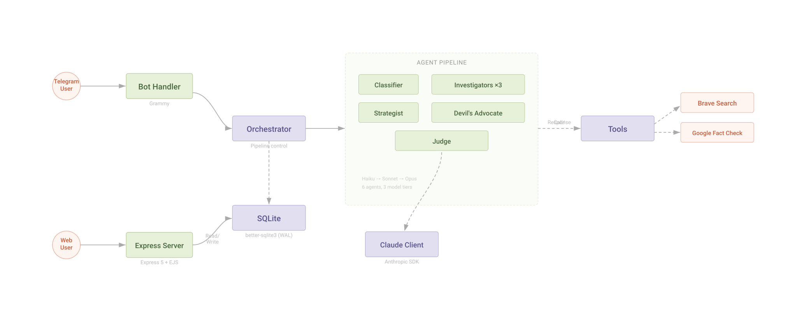
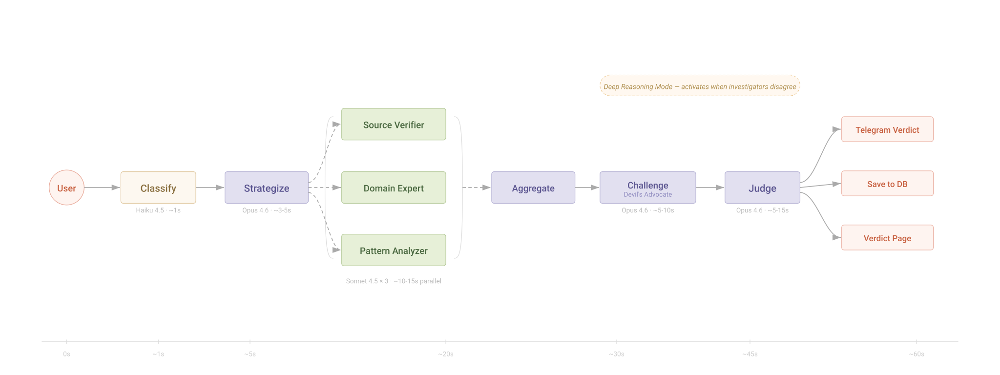

<p align="center">
  
</p>

# ForwardCheck-AI

Someone forwards you a viral message. "PM Modi is giving Rs 5000 to everyone!" You've seen it before. You don't believe it — but your uncle does. So does your neighbor. By the time a fact-checker publishes a response three days later, the damage is done.

**ForwardCheck-AI is a Telegram bot that fact-checks forwarded messages in minutes, not days.** Six AI agents work like an investigative newsroom — a classifier, a strategist, three parallel investigators, a devil's advocate, and a judge — to deliver a nuanced verdict with manipulation analysis. Not just "true" or "false." It shows you _how_ a message is trying to trick you.

[Try it on Telegram](https://t.me/forward_check_opus_bot) | [Live Demo](https://sincere-love-production-ced7.up.railway.app) | [See a Verdict](https://sincere-love-production-ced7.up.railway.app/v/yKprBhIxQ6G41O4u_UvLW) | [Hackathon Info](HACKATHON_INFO.md)

---

## What happens when you hit forward

```
Your message
    │
    ▼
┌─────────────┐
│  Classifier  │  Haiku — reads the message in a blink
└──────┬──────┘
       ▼
┌─────────────┐
│  Strategist  │  Opus 4.6 — plans what to search and what would prove it wrong
└──────┬──────┘
       ▼
┌──────┴──────────────────────┐
│     3 Investigators          │  Sonnet — dig through sources in parallel
│  Source · Domain · Pattern   │
└──────┬──────────────────────┘
       ▼
┌─────────────┐
│  Devil's     │  Opus 4.6 — tries to tear the findings apart
│  Advocate    │
└──────┬──────┘
       ▼
┌─────────────┐
│    Judge     │  Opus 4.6 — weighs everything, delivers the verdict
└──────┬──────┘
       ▼
   Your verdict
```

The whole thing takes 30-70 seconds. You get a verdict in Telegram with a link to the full analysis page.

---

## What makes this different

### See the tricks, not just the label

Most fact-checkers stop at "true" or "false." ForwardCheck shows you the manipulation techniques — emotional framing, authority impersonation, urgency tactics, cherry-picked data. You don't just learn what's fake. You learn how to spot it yourself.

### Watch the AI argue with itself

A Devil's Advocate agent receives all investigation findings and constructs the strongest possible counter-argument. When it says _"I tried to argue against the consensus and failed"_ — that's a confidence signal no single model can produce.

Both the Devil's Advocate and the Judge show their reasoning on the verdict page. You read the actual thinking. Not a black box that says "trust me."

### Four scores, not one

One number can't capture the truth. ForwardCheck breaks confidence into four parts:

| Component | What it measures |
|-----------|-----------------|
| **Evidence strength** | How strong is the evidence found? |
| **Source reliability** | How trustworthy are the sources? |
| **Claim complexity** | How easy is this claim to verify? |
| **Counter-argument resilience** | How well did the verdict survive the Devil's Advocate? |

### Deep Reasoning Mode

When investigators disagree (confidence spread > 30 points), the system automatically invests more computational effort. The Devil's Advocate escalates to maximum thinking depth. You see a "Deep Reasoning Mode" indicator on the verdict page — the system worked harder because the claim was genuinely contested.

---

## Three-tier model strategy

<p align="center">
  
</p>

We don't throw Opus at everything. Each model does what it's best at.

| Tier | Model | Role | Why |
|------|-------|------|-----|
| **Routing** | Haiku 4.5 | Classifier | Classification is simple. ~$0.01/call. |
| **Investigation** | Sonnet 4.5 | 3 Investigators | Search and summarize. Capable and fast. ~$0.30/call. |
| **Reasoning** | Opus 4.6 | Strategist, Devil's Advocate, Judge | Planning, adversarial thinking, synthesis. ~$0.20-2.00/call. |

Three guaranteed Opus 4.6 calls per investigation. Each one uses a _different_ capability:

1. **Strategic Planning** — maps out search queries and defines falsification criteria before any search begins
2. **Adversarial Challenge** — constructs the strongest counter-argument against the investigation findings
3. **Tool-Augmented Verification** — runs independent searches and decomposes confidence into four auditable components

---

## Quickstart

### Prerequisites

- Node.js 20+
- Anthropic API key
- Telegram Bot Token (from [@BotFather](https://t.me/BotFather))
- Brave Search API key (optional — for web search)
- Google Fact Check API key (optional — for fact-check lookups)

### Run locally

```bash
# Clone the repo
git clone https://github.com/chandrameenamohan/forward-check-ai.git
cd forward-check-ai

# Install dependencies
npm install

# Set up environment
cp .env.example .env
# Edit .env with your API keys

# Build and start
npm run build
npm start
```

The bot starts polling Telegram. The web server runs on `http://localhost:3000`.

### Environment variables

| Variable | Required | Description |
|----------|----------|-------------|
| `ANTHROPIC_API_KEY` | Yes | Your Anthropic API key |
| `TELEGRAM_BOT_TOKEN` | Yes | Bot token from BotFather |
| `BRAVE_SEARCH_API_KEY` | No | Brave Search API key for web search |
| `GOOGLE_FACTCHECK_API_KEY` | No | Google Fact Check API key |
| `PORT` | No | Server port (default: 3000) |
| `DATABASE_PATH` | No | SQLite path (default: `./data/forwardcheck.db`) |

---

## Architecture

<p align="center">
  
</p>

### Project structure

```
src/
├── agents/                    # AI agent implementations
│   ├── classifier-agent.ts        # Haiku — routes messages
│   ├── strategist-agent.ts        # Opus — plans investigation
│   ├── investigators/             # Sonnet — parallel evidence gathering
│   │   ├── source-verification-agent.ts
│   │   ├── domain-expertise-agent.ts
│   │   └── pattern-matching-agent.ts
│   ├── devils-advocate-agent.ts   # Opus — adversarial challenge
│   └── judge-agent.ts            # Opus — final synthesis + verdict
├── orchestrator/
│   ├── pipeline.ts               # End-to-end investigation orchestration
│   └── agent-runner.ts           # Generic agent execution loop
├── tools/
│   ├── brave-search.ts           # Brave Web Search API
│   ├── google-factcheck.ts       # Google Fact Check API
│   └── tool-registry.ts          # Tool dispatch
├── schemas/                   # Zod validation for all agent I/O
├── formatter/
│   ├── confidence-gates.ts       # Mechanical confidence gate enforcement
│   └── telegram-formatter.ts     # Telegram HTML output
├── bot/                       # Grammy Telegram bot
├── server/                    # Express 5 + verdict web pages
├── db/                        # SQLite persistence
├── services/                  # Claude client + claim cache
└── config/                    # Environment + logging
```

### Key design decisions

- **Raw Anthropic SDK** over Agent SDK — deterministic orchestration, per-agent model selection, full debugging transcripts
- **Workflow, not autonomous agents** — the orchestrator controls flow, agents don't self-direct
- **Context isolation** — agents compress search results into structured reports; the Judge never sees raw HTML
- **Sequential Devil's Advocate** — runs _after_ all findings, not in parallel; produces genuine adversarial review
- **Judge-as-verifier** — the Judge can independently search to verify contested points
- **Confidence gates** — mechanical overrides prevent miscalibrated verdicts (e.g., "likely-true" at 70% gets corrected to "partially-true")

### Data flow

<p align="center">
  
</p>

---

## Tech stack

| Layer | Choice | Why |
|-------|--------|-----|
| Language | TypeScript (strict ESM) | Type safety across 5 agent schema boundaries |
| Runtime | Node.js 20+ | LTS, native ESM |
| Telegram | Grammy | Purpose-built, middleware pattern |
| Web | Express 5 + EJS | Simple, proven |
| Database | better-sqlite3 (WAL) | Zero deployment friction |
| Validation | Zod | Runtime + compile-time types from one definition |
| AI | @anthropic-ai/sdk | Per-agent model selection, full control |
| Search | Brave Search + Google Fact Check | Two independent sources |
| Testing | Vitest | Fast, TypeScript-native |

---

## Verdict taxonomy

Six categories with mechanical confidence gates and optional nuance tags:

| Category | Confidence Range | When |
|----------|-----------------|------|
| `likely-true` | 85-100% | Strong evidence supports the claim |
| `partially-true` | 60-84% | Some truth, but incomplete or distorted |
| `unverified` | 30-59% | Insufficient evidence either way |
| `likely-false` | 0-29% | Strong evidence contradicts the claim |
| `satire` | Any | Clearly satirical content |
| `opinion` | Any | Value judgment, not a factual claim |

**Nuance tags** add depth: `misleading` · `out-of-context` · `exaggerated` · `fabricated` · `recirculated` · `scam`

Example: **LIKELY FALSE (8%) — Fabricated**

---

## Testing

```bash
# Run all unit tests
npm test

# Run with coverage
npm run test:coverage

# Run integration tests (requires ANTHROPIC_API_KEY)
npm run test:integration
```

The test suite includes unit tests with mocked SDK responses and integration tests that make real API calls to validate agent behavior.

---

## More diagrams

Full architecture documentation with 10 rendered diagrams lives in [`docs/architecture/`](docs/architecture/) and [`ARCHITECTURE.md`](ARCHITECTURE.md).

| Diagram | What it shows |
|---------|---------------|
| [System Context](docs/architecture/01-system-context.png) | External dependencies and boundaries |
| [Component Architecture](docs/architecture/02-component-architecture.svg) | Internal module structure |
| [Agent Pipeline](docs/architecture/03-agent-pipeline.svg) | Complete data flow through 6 agents |
| [Three-Tier Model](docs/architecture/04-three-tier-model.svg) | Haiku / Sonnet / Opus allocation |
| [Data Model](docs/architecture/05-data-model.png) | Entity relationships |
| [Sequence Lifecycle](docs/architecture/06-sequence-lifecycle.svg) | Full investigation sequence diagram |
| [Tool Dispatch](docs/architecture/07-tool-dispatch.png) | How agents call external tools |
| [Deployment](docs/architecture/08-deployment-runtime.png) | Runtime architecture |
| [Cost Model](docs/architecture/09-cost-model.png) | Per-agent cost breakdown |
| [Confidence Gates](docs/architecture/10-confidence-gates.png) | Verdict category enforcement |

Interactive process diagrams: [`docs/diagrams/`](docs/diagrams/)

---

## Cost per investigation

| Agent | Model | Est. Cost |
|-------|-------|-----------|
| Classifier | Haiku 4.5 | ~$0.01 |
| Strategist | Opus 4.6 | ~$0.20-0.50 |
| 3 Investigators | Sonnet 4.5 | ~$0.90-1.20 |
| Devil's Advocate | Opus 4.6 | ~$0.50-1.00 |
| Judge | Opus 4.6 | ~$1.00-2.00 |
| **Total** | | **~$2.60-4.70** |

---

## License

MIT License — see [LICENSE](LICENSE)
