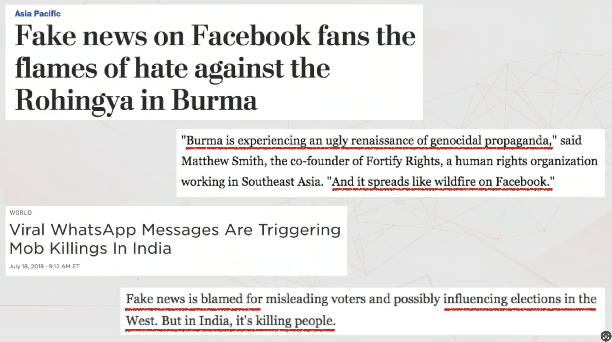
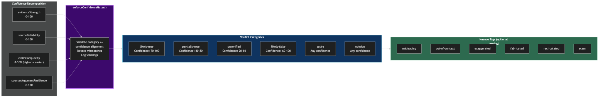
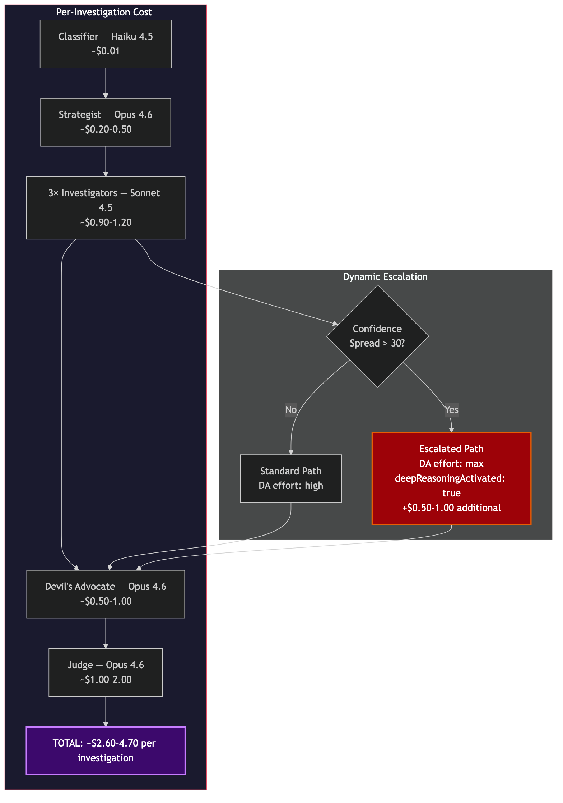

# ForwardCheck-AI: How We Built a Multi-Agent Fact-Checking Pipeline with Claude

*An engineering deep-dive into orchestrating six AI agents to fact-check viral claims in 60 seconds*

**Chandra Mohan Meena** | chandrameenamohan@gmail.com | February 16, 2026

---

Your mom just forwarded you a message. "NASA confirmed 15 days of total darkness in November." She added three prayer emojis and the words "please share with everyone you love."

You know it's fake. You can feel it in your gut. But can you **prove** it in the next 30 seconds, before she sends it to 200 more people?

That's the problem. Misinformation doesn't wait for you to fact-check it. A forwarded message rips through 50 group chats before you finish reading the first paragraph. By the time a fact-checker at Snopes writes a debunk, the claim has reached ten million screens. The lie is fast. The truth is slow. And the gap between them is where people get hurt.

<p align="center">
  
  <br><em>Misinformation isn't abstract. It fans genocide in Burma. It triggers mob killings in India. — <a href="https://www.youtube.com/watch?v=-7ORAKULel4&t=297s">Source</a></em>
</p>

I wanted to flip that. I wanted to build something that could fact-check a viral claim **faster than it spreads**. Not a search engine. Not a chatbot that says "I'm not sure." A team of AI agents that investigate like a newsroom, argue like lawyers, and deliver a verdict you can see through -- reasoning and all.

So I built ForwardCheck-AI. You forward a suspicious message to a Telegram bot -- or type it into the web chat. Sixty seconds later, six AI agents hand you a verdict. You see the evidence. You see the counter-arguments. You see the thinking process of the AI that made the call. No black box. No "trust me." Just transparent reasoning you can inspect with your own eyes.

---

## The Problem

Here is what fact-checking looks like today. You copy the claim. You open Google. You type a search. You scan ten results. You try to figure out which sources are credible. You give up after four minutes and close the tab. The message stays in the group chat, unanswered. Your mom still thinks NASA predicted darkness.

Professional fact-checkers do better work. But there are about 400 of them covering the entire internet. They publish debunks in articles that take hours or days to write. Meanwhile, a single WhatsApp forward reaches 50 group chats in ten minutes. The infrastructure for spreading lies is instant and free. The infrastructure for checking them is manual, expensive, and slow. That gap is the problem -- and no amount of "media literacy" fixes a system where the lie has a ten-hour head start.

ForwardCheck-AI closes that gap. It puts a full investigative newsroom -- source verification, domain expertise, pattern matching, adversarial challenge, and final judgment -- inside a Telegram message or a web chat. One forward. Sixty seconds. A verdict with receipts.

---

## Why Multi-Agent?

A single LLM call can't fact-check well. We tried. You send a claim like "PM Modi announced Rs 5000 direct transfer to all citizens" to Claude, and it produces a plausible-sounding response grounded in whatever its training data contains. But misinformation is adversarial by design -- it evolves faster than any model's knowledge cutoff. Effective fact-checking requires live web search, multiple independent source evaluations, and adversarial stress-testing of conclusions. No single prompt can do all of that.

The deeper problem is that different stages of fact-checking require fundamentally different cognitive work. Routing a message into categories is trivial pattern matching. Planning an investigation strategy requires meta-cognition. Searching the web and summarizing results is capable but mechanical. Constructing a counter-argument against a consensus requires deep adversarial reasoning. Synthesizing contradictory evidence into a calibrated verdict demands the highest reasoning depth available. Asking one model at one effort level to do all of these things produces mediocre results at every stage.

Our answer is a 6-agent pipeline where each agent is right-sized for its task. Three tiers of models, five distinct reasoning modes, and a deterministic orchestrator that controls the entire flow:

<p align="center">
  
  <br><em>The six-agent pipeline: message flows left to right through classification, strategy, parallel investigation, adversarial challenge, and final verdict.</em>
</p>

Parallel investigation is critical for both speed and quality. Three investigators with different specializations (source verification, domain expertise, pattern matching) search independently, guided by the Strategist's targeted queries. Because they run via `Promise.allSettled()`, a single investigator failure doesn't crash the pipeline -- we proceed with whatever reports succeed. In practice, the total investigation time is bounded by the slowest investigator, not the sum of all three.

---

## The Six Agents

<p align="center">
  
  <br><em>Investigation lifecycle: each agent's execution mapped on a timeline — from classification (~1s) through parallel investigation (~20s) to final verdict (~60s).</em>
</p>

### 1. Classifier (Haiku 4.5) -- The Gatekeeper

The Classifier is the simplest agent in the pipeline and we chose the lightest model on purpose. Its job is pure routing: is this message a factual claim, an opinion, a scam, a greeting, or something else? One turn, no tools, no thinking, structured JSON output.

At ~$0.01 per call, the Classifier is free in practice. We parse its raw text response as JSON, validate against a Zod schema, and retry once on parse failure. This is the only agent that doesn't use tool-based structured output -- Haiku's classification is reliable enough that JSON parsing with a retry covers edge cases.

> **Insight:** Classification is routing, not reasoning. Using Opus here would cost 30x more per call with no measurable improvement. The cost savings are invested where reasoning depth matters.

### 2. Claim Strategist (Opus 4.6) -- The Assignment Editor

Before any investigator touches a search engine, the Strategist plans the entire investigation. This is meta-cognition -- Opus 4.6 thinking about *how* to think about a problem. It receives the Classifier's output and uses extended thinking (adaptive, effort: "medium") to generate targeted search queries for each investigator role, define falsification criteria ("what specific evidence would prove this claim true or false?"), and identify suspected misinformation patterns.

The Strategist's output is a `SearchStrategy` schema containing 2-5 queries per investigator role, priority sources to check, and explicit falsification criteria. These queries are injected into each investigator's system prompt, transforming their searches from generic to surgical. Without the Strategist, investigators default to obvious keyword searches. With it, they search for specific government gazette entries, press release archives, and known debunk databases.

> **Key design choice:** This stage exists to justify Opus 4.6 usage. Raw usage of Opus to search the web would be wasteful. But using Opus to *plan* an investigation, then delegating search to cheaper Sonnet agents? That's architectural wisdom.

### 3. Three Investigators (Sonnet 4.5) -- The Reporters

Three investigators run in parallel, each with a different specialization but sharing the same tools (`brave_web_search`, `google_fact_check_search`). They differentiate through system prompts, not tool sets -- following Anthropic's own guidance on multi-agent design.

- **Source Verification** finds the claim's origin, traces its propagation, and checks whether it has been debunked before.
- **Domain Expertise** checks factual accuracy against authoritative sources specific to the claim's domain (public health, geopolitics, economics, etc.), with its system prompt templated based on the Classifier's domain field.
- **Pattern Matching** targets fact-checker databases -- Snopes, PolitiFact, AltNews, BoomLive -- and identifies known misinformation patterns like zombie claims, chain message formats, and authority impersonation.

Each investigator runs in the generic `runAgent()` loop with 6 turns max and submits a structured `AgentReport` via a `submit_report` tool. We use Sonnet because search-and-summarize doesn't need frontier reasoning -- it needs capable tool use and reliable structured output.

```typescript
const results = await Promise.allSettled([
  runSourceVerification(claim, searchStrategy, client, toolRegistry),
  runDomainExpertise(claim, domain, searchStrategy, client, toolRegistry),
  runPatternMatching(claim, searchStrategy, client, toolRegistry),
]);
```

`Promise.allSettled()` is the key design choice. If one investigator hits an API timeout or returns malformed output, the other two still contribute their reports. The pipeline only fails if all three investigators fail -- a threshold that has never been triggered in production.

### 4. Devil's Advocate (Opus 4.6) -- The Red Team

The Devil's Advocate is the most unconventional agent in the pipeline and the one that justifies the entire multi-agent architecture. It runs *sequentially* -- it must see all investigator findings before it can challenge them. Its job: construct the strongest possible counter-argument to the investigator consensus, then report with honesty whether that counter-argument succeeded or failed.

The DA receives all `AgentReport` objects plus the Strategist's falsification criteria. It uses adaptive thinking with effort level "high" by default, but the orchestrator escalates to "max" when investigators disagree (confidence spread > 30 points). This dynamic escalation is visible to users as a "Deep Reasoning Mode" indicator.

The DA's thinking blocks are captured and displayed to users on the verdict page. When the DA says "I attempted to find any credible source supporting this claim and could not," that transparency is more convincing than any confidence number. The *failure* of the counter-argument is itself the highest-quality confidence signal in the system.

> **Insight:** When you ask a model "how confident are you?", it pattern-matches to a plausible number. When you force it to construct the strongest possible argument against its own findings and it fails, the resulting confidence is grounded in actual epistemic work.

### 5. Judge (Opus 4.6) -- The Senior Editor

The Judge is the most capable agent in the pipeline -- Opus 4.6 with adaptive thinking at maximum effort, access to `brave_web_search` for independent verification, and a 4-phase reasoning process:

1. **Strategize**: Review the falsification criteria. What was sought? What was found? What's missing?
2. **Synthesize**: Resolve contradictions between investigator reports.
3. **Evaluate**: If the DA raised critical challenges, verify them with its own web search.
4. **Verdict**: Render a structured `FinalVerdict` via the `submit_verdict` tool.

The Judge doesn't produce a single confidence number. It decomposes confidence into four auditable components: evidence strength, source reliability, claim complexity (ease of verification), and counter-argument resilience. Each component is visible on the verdict page, turning a black-box percentage into an auditable breakdown.

---

## What Makes This Novel

### 1. Investigation Planning Before Searching

Most AI systems do the obvious thing: take a claim, run a search, summarize results. ForwardCheck does something different. Before any search query fires, an Opus 4.6 **Claim Strategist** uses extended thinking to _plan the investigation itself_.

The Strategist receives a classified claim and reasons through it: What kind of misinformation pattern might this be? What specific evidence would **prove it true**? What would **prove it false**? It generates targeted search queries for each investigator role, identifies priority sources, and defines falsification criteria -- all before a single web request leaves the server.

> This is meta-cognition applied to fact-checking. The AI doesn't just answer the question -- it reasons about HOW to answer the question.

The falsification criteria surface on the verdict page as **"What Would Prove This Wrong"** -- a section that teaches users to think like investigators. The Strategist's output (`SearchStrategy`) becomes the operating blueprint for every downstream agent. Investigators don't freestyle; they execute a plan designed by a frontier reasoning model.

### 2. Adversarial Self-Review as Confidence Calibration

Ask any LLM "how confident are you?" and it pattern-matches to a plausible number. ForwardCheck takes a different approach: it forces the AI to **argue against its own findings**, and measures what happens.

The **Devil's Advocate** receives the full evidence package and constructs the **strongest possible counter-argument** to the consensus. Its system prompt demands intellectual honesty: after building the best case against the findings, it must state whether its counter-argument **succeeded or failed**.

When the DA fails to construct a viable counter-argument, that failure is the confidence signal. Not a self-reported number -- an **epistemic outcome**. The model genuinely wrestled with the opposing view and couldn't make it stick.

> "I tried to argue against the consensus and failed" is a fundamentally different kind of confidence than "I am 92% sure."

### 3. Visible Extended Thinking

AI transparency usually means showing a list of sources. ForwardCheck goes further: it displays **Opus 4.6's actual reasoning process** to end users.

Two separate thinking excerpts appear on the verdict page. The first comes from the **Devil's Advocate**, showing how Opus constructed its counter-argument -- users can read the model reasoning through uncertainty, testing hypotheses, and reaching its conclusion. The second comes from the **Judge**, revealing how it synthesized conflicting investigator reports, weighed the DA's challenges, and arrived at its verdict.

These aren't summaries or post-hoc explanations. They're **extracted from Opus 4.6's extended thinking blocks** -- the `block.thinking` content from the API response, surfaced to the frontend.

> Every consumer-facing AI product hides how it thinks. ForwardCheck shows it.

### 4. Dynamic Reasoning Depth

Not every claim deserves the same computational investment. A viral hoax with unanimous debunks from three investigators is a different problem than a contested health claim where one agent says "supported" and another says "contradicted."

ForwardCheck **detects investigator disagreement** in real time. The orchestrator calculates the confidence spread across all agent reports. When the spread exceeds 30 points, the system escalates:

- DA effort level jumps from **"high" to "max"**
- A `deepReasoningActivated` flag propagates through the pipeline
- The verdict page displays a **"Deep Reasoning Mode"** indicator

The system invests more thinking tokens on claims that genuinely warrant deeper analysis. Users see the system working harder on harder problems.

### 5. Confidence Decomposition

A verdict that says "85% confident" tells you almost nothing. Confident in what? Based on what evidence? ForwardCheck replaces the single number with **four auditable components**:

- **Evidence Strength** (0-100): How strong is the evidence the investigators found?
- **Source Reliability** (0-100): How trustworthy are the sources cited?
- **Claim Complexity** (0-100): How easy is this claim to verify? (Higher = easier)
- **Counter-Argument Resilience** (0-100): How well did the verdict survive the DA's challenge?

A claim might score 90% on evidence strength but only 60% on source reliability -- telling the user: strong evidence, questionable sources. This turns confidence from an opaque assertion into an auditable breakdown.

### 6. Three-Tier Model Strategy

ForwardCheck doesn't throw its most expensive model at every task. It routes **Haiku for classification** (~$0.01), **Sonnet for investigation** (~$0.30 per agent), and **Opus for reasoning** (~$0.50-2.00 per agent). Three model tiers, each selected for what the task demands.

<p align="center">
  
  <br><em>Three-tier model strategy: Haiku (routing), Sonnet (investigation), Opus (reasoning) — each tier maps to the cognitive demand of the task.</em>
</p>

This isn't cost optimization for its own sake. It's an **architectural statement**: the right model for the right task. The three-tier strategy keeps the average investigation cost at **~$0.55** while concentrating Opus's reasoning power where it produces outputs that cheaper models cannot replicate.

---

## How Opus 4.6 Shines

<p align="center">
  
  <br><em>Component architecture: both Telegram and Web Chat entry points feed the Investigation Pipeline, which orchestrates agents, tools, storage, and the Anthropic Claude API.</em>
</p>

ForwardCheck uses Opus 4.6 in **four distinct reasoning modes**, each showcasing a capability that simpler models cannot replicate. This isn't one model doing one thing four times -- it's four fundamentally different applications of frontier reasoning.

**Strategic Meta-Cognition (Strategist).** The Claim Strategist uses adaptive thinking at "medium" effort to plan investigations before they begin. It generates targeted search queries, identifies priority authoritative sources, and defines **falsification criteria**: what specific evidence would prove the claim true, and what would prove it false. This is the model reasoning about _how to reason about a problem_. Simpler models can search and summarize; Opus plans the investigation itself.

**Adversarial Reasoning Under Uncertainty (Devil's Advocate).** After receiving all investigator findings, the DA uses adaptive thinking at "high" effort (escalating to "max" when investigators disagree) to construct the strongest possible counter-argument. Its system prompt demands honesty: the model must evaluate whether its own counter-argument succeeds or fails. The DA's extended thinking is extracted from the API response and displayed to users.

**Multi-Turn Tool-Augmented Verification (Judge).** The Judge operates at "max" effort with access to `brave_web_search`. It follows a 4-phase process across up to 5 turns. When the DA raises critical challenges, the Judge **independently verifies contested points** with its own searches -- it doesn't just summarize, it fact-checks the fact-checkers.

**Effort-Level Adaptation.** The system doesn't treat every claim the same. Opus's adaptive thinking with explicit effort levels ("medium" for Strategist, "high"/"max" for DA, "max" for Judge) means different depths of reasoning for different pipeline stages. When investigators produce divergent findings, the orchestrator escalates DA effort -- the model thinks harder about harder problems.

> We DON'T use Opus for everything. Investigators use Sonnet because search-and-summarize doesn't need frontier reasoning. This shows we understand WHEN Opus capabilities matter -- and when they don't.

---

## Engineering Principles

**1. Right-size computational investment.** Not every task deserves frontier reasoning. We use a 3-tier model strategy that maps cognitive complexity to model capability:

| Tier | Model | Agent(s) | Reasoning Required | Cost/Call |
|------|-------|----------|-------------------|-----------|
| **Routing** | Haiku 4.5 | Classifier | Pattern matching | ~$0.01 |
| **Investigation** | Sonnet 4.5 | 3 Investigators | Search + summarize | ~$0.30-0.40 |
| **Reasoning** | Opus 4.6 | Strategist, DA, Judge | Meta-cognition, adversarial review, synthesis | ~$0.20-1.00 |

This keeps the total pipeline cost under $2.00 per investigation while concentrating reasoning budget where it matters.

**2. Graceful degradation over graceful failure.** `Promise.allSettled()` for parallel investigators means one failure doesn't crash the pipeline. Tool execution errors are caught and returned as content strings -- never thrown. The agent receives "Error: search API returned 429" as a tool result and adapts its strategy. The only hard failure is if *all* investigators fail.

**3. Mechanical guardrails over prompt-based calibration.** LLMs are miscalibrated. Our confidence gates enforce alignment between verdict category and confidence score. If the Judge says "likely-true" with 70% confidence, the formatter overrides to "partially-true."

<p align="center">
  
  <br><em>Confidence decomposition feeds into enforceConfidenceGates(), which validates category-confidence alignment and applies nuance tags.</em>
</p>

```typescript
const GATES: Gate[] = [
  { min: 85, max: 100, category: "likely-true" },
  { min: 60, max: 84,  category: "partially-true" },
  { min: 30, max: 59,  category: "unverified" },
  { min: 0,  max: 29,  category: "likely-false" },
];
```

**4. Staged persistence saves debugging hours.** Every pipeline stage writes to SQLite after completion. If the Judge crashes at turn 3, we have the Classifier result, the SearchStrategy, all investigator reports, and the DA challenge saved. We can inspect what each agent saw, rerun from any stage, and correlate failures with specific inputs.

**5. Dynamic reasoning depth for contested claims.** When investigators agree (confidence spread < 30 points), the DA runs at "high" effort. When they disagree, the orchestrator escalates to "max" and sets a `deepReasoningActivated` flag visible to users.

<p align="center">
  
  <br><em>Per-investigation cost flow with the dynamic escalation decision point: confidence spread > 30 triggers "max" effort path.</em>
</p>

```typescript
const spread = Math.max(...confidenceScores) - Math.min(...confidenceScores);
const deepReasoningActivated = spread > DISAGREEMENT_SPREAD_THRESHOLD;
const daEffort = deepReasoningActivated ? "max" : "high";
```

**6. One generic agent runner for all agents.** A single `runAgent()` function handles the multi-turn tool-use loop for every agent. It manages message array construction, tool dispatch, thinking block extraction, token accumulation, and timeout enforcement via `Promise.race()`. New agents are added by writing a system prompt and defining tools -- the execution loop is shared infrastructure.

**7. Zod schemas at every agent-to-agent boundary.** All inter-agent data flows through Zod-validated schemas: `ClassifierResult`, `SearchStrategy`, `AgentReport`, `ChallengeReport`, `FinalVerdict`. When an agent produces malformed output, we get a specific Zod error with the failing field path -- not a mysterious downstream crash three stages later.

---

## Production Lessons

### The Confidence Gate Semantic Mismatch

Our most insidious bug was a semantic mismatch in what "confidence" means. The Judge would return verdicts like: category `likely-false`, confidence `97%`. The confidence gates would see 97% and override the category to `likely-true` -- the exact opposite of the Judge's intent.

The root cause: the Judge was interpreting "confidence" as "how certain am I in my verdict?" (97% certain it's false), while our gates treat it as "how likely is this claim to be true?" (97% = very likely true). Same word, different semantics.

The fix was prompt engineering, not code. We added explicit instructions: "The confidence field is a TRUTHFULNESS SCORE -- it measures how likely the claim is to be TRUE on a 0-100 scale." After this, the gate override rate dropped from ~40% to under 5%.

> **Lesson:** When you build mechanical guardrails around LLM outputs, make sure the model and the guardrails agree on what the fields mean. Ambiguous semantics in system prompts create bugs that look like model failures but are specification failures.

### Nested JSON in Tool Outputs

The Anthropic SDK occasionally returns nested fields inside `tool_use` input blocks as JSON strings instead of parsed objects. This caused intermittent Zod validation failures that were hard to reproduce.

Our fix is a recursive `deepParseJsonStrings()` utility that walks the object tree and attempts to parse any string value that looks like JSON. The function is conservative: if `JSON.parse()` fails, it returns the original string unchanged.

```typescript
function deepParseJsonStrings(obj: unknown): unknown {
  if (typeof obj === "string") {
    const trimmed = obj.trim();
    if (trimmed.startsWith("{") || trimmed.startsWith("[")) {
      try { return deepParseJsonStrings(JSON.parse(trimmed)); }
      catch { return obj; }
    }
    return obj;
  }
  if (Array.isArray(obj)) return obj.map(deepParseJsonStrings);
  if (obj !== null && typeof obj === "object") {
    const result: Record<string, unknown> = {};
    for (const [key, val] of Object.entries(obj))
      result[key] = deepParseJsonStrings(val);
    return result;
  }
  return obj;
}
```

### SQLite Timestamp Ordering

We used `datetime('now')` for ordering investigations by recency. SQLite's `datetime()` has second-level precision, so two operations within the same second appear in arbitrary order. The fix: `ORDER BY rowid DESC` instead of `ORDER BY created_at DESC`. SQLite's `rowid` is a monotonically increasing integer that captures insertion order with no ambiguity.

### Grammy 409 Conflicts on Deploy

When deploying a new version of the Telegram bot while the old instance is still polling, the Telegram API returns HTTP 409. Grammy treats this as fatal and crashes. Our fix implements exponential backoff for bot startup: base delay of 3 seconds, 5 retries, 2x doubling factor. The old instance's polling connection times out within 10-15 seconds, so the new instance connects once the old one releases.

---

## Impact: Who Benefits?


Fact-checking has always been locked behind institutional walls. Professional fact-checkers need editorial oversight, source networks, domain expertise, and days of investigation time. Organizations like Snopes and PolitiFact handle a few hundred claims per month. Meanwhile, a single viral forward reaches **millions of people in hours**.

ForwardCheck puts an entire investigative newsroom in anyone's pocket. Forward a suspicious message to a Telegram bot. In **30-70 seconds**, six AI agents classify the claim, plan an investigation, search the web in parallel, challenge their own findings, and deliver a nuanced verdict -- all for roughly **$0.55**. The barrier drops from "journalist with institutional support" to "anyone with Telegram."

The impact goes beyond labeling claims true or false. ForwardCheck's **Manipulation Techniques** feature identifies _how_ users are being manipulated -- authority impersonation, urgency tactics, emotional appeals, statistical distortion. Each technique is quoted from the original message with a severity score. This doesn't just answer "is this true?" -- it teaches users to **recognize propaganda patterns** so they can spot manipulation in messages the bot never sees.

The hackathon theme -- **"Break the Barriers"** -- asks builders to take something locked behind expertise and put it in everyone's hands. Misinformation hits hardest in communities with the least access to institutional fact-checking: non-English speakers receiving forwarded health hoaxes, communities targeted by financial scams, populations where viral forwards shape political reality. ForwardCheck works in any language Telegram and Claude support, makes its reasoning visible and auditable, and delivers verdicts with **decomposed confidence** so users can evaluate the AI's work -- not just trust it blindly.

---

## Architecture At a Glance

```
src/
├── agents/
│   ├── classifier-agent.ts         # Haiku 4.5 — 1 turn, routes messages
│   ├── strategist-agent.ts         # Opus 4.6 — plans investigation strategy
│   ├── investigators/
│   │   ├── source-verification-agent.ts   # Sonnet 4.5 — origin + credibility
│   │   ├── domain-expertise-agent.ts      # Sonnet 4.5 — domain fact-check
│   │   └── pattern-matching-agent.ts      # Sonnet 4.5 — fact-checker databases
│   ├── devils-advocate-agent.ts    # Opus 4.6 — adversarial counter-argument
│   ├── judge-agent.ts              # Opus 4.6 — synthesis + verification + verdict
│   └── non-factual-handler.ts      # Handles opinions, greetings, scams
├── orchestrator/
│   ├── pipeline.ts                 # Main investigation pipeline
│   ├── agent-runner.ts             # Core agentic tool-use loop
│   └── pipeline-events.ts          # SSE event bus for real-time UI updates
├── tools/
│   ├── brave-search.ts             # Brave Search API integration
│   ├── google-factcheck.ts         # Google Fact Check API integration
│   └── tool-registry.ts            # Tool discovery and execution
├── services/
│   ├── claude-client.ts            # Anthropic SDK wrapper with cost tracking
│   ├── claim-cache.ts              # In-memory TTL cache for repeated claims
│   └── url-extractor.ts            # Extract + enrich content from URLs
├── bot/
│   ├── bot.ts                      # Grammy Telegram bot setup
│   ├── message-handler.ts          # Forwarded message processing
│   └── status-updater.ts           # Real-time Telegram status messages
├── server/
│   ├── app.ts                      # Express 5 server
│   ├── routes/                     # API + verdict page routes
│   └── views/                      # EJS verdict page templates
├── db/
│   ├── connection.ts               # better-sqlite3 with WAL mode
│   ├── migrations.ts               # Schema migrations
│   └── investigation-repository.ts # CRUD for investigations
├── schemas/                        # Zod schemas for all agent I/O
├── formatter/                      # Verdict formatting + confidence gates
├── config/                         # Logger, environment config
└── index.ts                        # Entry point
```

### By the Numbers

| Metric | Value |
|--------|-------|
| **Lines of TypeScript** | ~5,400 |
| **Pipeline agents** | 6 (Classifier, Strategist, 3 Investigators, DA, Judge) |
| **Opus 4.6 agents** | 3 (Strategist, DA, Judge) |
| **Average investigation time** | 30-70 seconds |
| **Average cost per investigation** | ~$0.55 |
| **Models used** | Haiku 4.5, Sonnet 4.5, Opus 4.6 |
| **External APIs** | Brave Search, Google Fact Check |
| **Storage** | SQLite with WAL mode |
| **Deployment** | Railway |
| **Zod schema boundaries** | 5 (ClassifierResult, SearchStrategy, AgentReport, ChallengeReport, FinalVerdict) |

---

## Conclusion

I started this project with a picture in my head. Someone's grandmother, alone at night, reading a forwarded message about a fake health cure. No one around to tell her it's wrong. No tool fast enough to catch it before she shares it with her entire contact list.

ForwardCheck-AI is six AI agents that do what a newsroom does, in the time it takes to brew a cup of coffee. The Classifier reads the claim. The Strategist plans the investigation. Three Investigators search the web in parallel. The Devil's Advocate tries to tear the findings apart. And the Judge weighs everything -- with its full reasoning visible to you. **Not hidden. Not summarized. Visible.** That's what makes this different from a chatbot that says "this might be false." You don't have to trust the answer. You can read the argument and decide for yourself.

This is not the end of misinformation. One Telegram bot won't fix a broken information ecosystem. But it proves something important: the same AI that people fear will generate misinformation can also **fight** it. The same model that can write a convincing lie can investigate one, challenge it, and show its work. The tool matters less than the design. Point the reasoning at the right problem, and it becomes a force for truth.

The forward button gave everyone the power to spread a lie. ForwardCheck-AI gives everyone the power to check one.

---

*Built with Claude (Haiku 4.5, Sonnet 4.5, Opus 4.6) for the ["Built with Opus 4.6" Hackathon](https://cerebralvalley.ai) by Cerebral Valley x Anthropic.*

*[GitHub](https://github.com/chandrameenamohan/forward-check-ai) | [Try the Telegram Bot](https://t.me/forward_check_opus_bot) | [Try the Web Chat](https://sincere-love-production-ced7.up.railway.app)*
