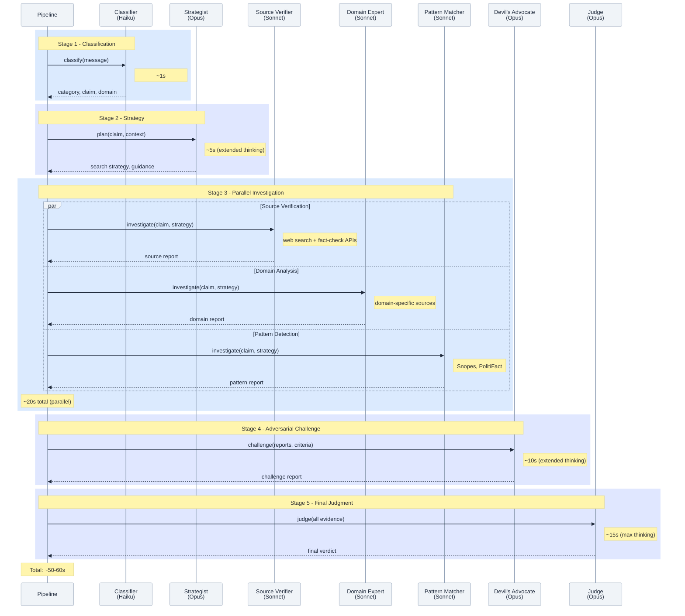
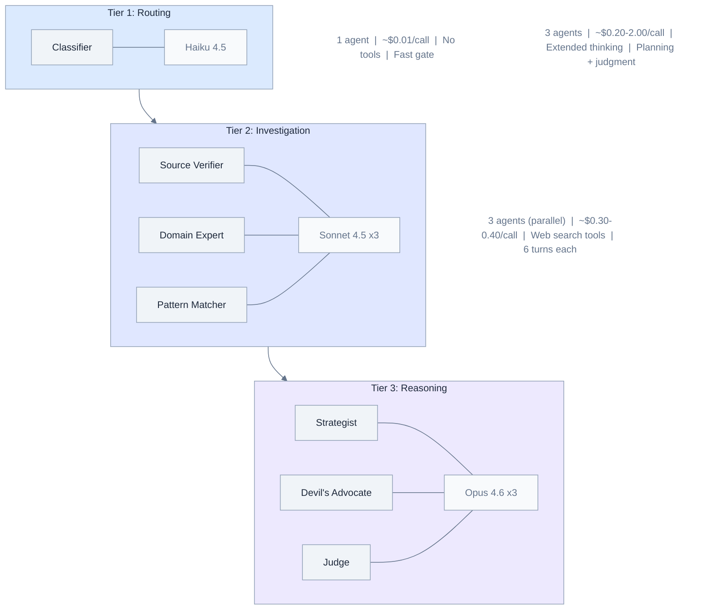

# ForwardCheck-AI Architecture Diagrams

---

## Diagram 1: Agent Pipeline

```mermaid
%%{init: {'theme': 'base', 'themeVariables': {'primaryColor': '#f0f4f8', 'primaryTextColor': '#1e293b', 'primaryBorderColor': '#94a3b8', 'lineColor': '#64748b', 'secondaryColor': '#dbeafe', 'tertiaryColor': '#f8fafc', 'fontSize': '14px', 'fontFamily': 'system-ui, -apple-system, sans-serif'}}}%%
flowchart LR
    MSG["Incoming Message"]
    MSG --> CL

    CL["Classifier\n(Haiku)"]
    CL -->|opinion / not factual| QR["Quick Response"]
    CL -->|factual claim| ST

    ST["Strategist\n(Opus)"]
    ST --> INV

    subgraph INV["Parallel Investigation"]
        direction TB
        SV["Source Verifier\n(Sonnet)"]
        DE["Domain Expert\n(Sonnet)"]
        PM["Pattern Matcher\n(Sonnet)"]
    end

    INV --> AGG["Aggregate Reports"]
    AGG --> SPREAD{"Confidence\nspread > 30?"}
    SPREAD -->|Yes| DEEP["Deep reasoning mode"]
    SPREAD -->|No| NORM["Standard mode"]
    DEEP --> DA
    NORM --> DA

    DA["Devil's Advocate\n(Opus)"]
    DA --> JDG

    JDG["Judge\n(Opus)"]
    JDG --> V["Final Verdict"]

    style MSG fill:#f8fafc,stroke:#94a3b8,stroke-width:1px,color:#1e293b
    style CL fill:#dbeafe,stroke:#94a3b8,stroke-width:1px,color:#1e293b
    style ST fill:#e0e7ff,stroke:#94a3b8,stroke-width:1px,color:#1e293b
    style SV fill:#dbeafe,stroke:#94a3b8,stroke-width:1px,color:#1e293b
    style DE fill:#dbeafe,stroke:#94a3b8,stroke-width:1px,color:#1e293b
    style PM fill:#dbeafe,stroke:#94a3b8,stroke-width:1px,color:#1e293b
    style AGG fill:#f0f4f8,stroke:#94a3b8,stroke-width:1px,color:#1e293b
    style SPREAD fill:#fef3c7,stroke:#d97706,stroke-width:1px,color:#1e293b
    style DEEP fill:#fef3c7,stroke:#d97706,stroke-width:1px,color:#1e293b
    style NORM fill:#f0f4f8,stroke:#94a3b8,stroke-width:1px,color:#1e293b
    style DA fill:#e0e7ff,stroke:#94a3b8,stroke-width:1px,color:#1e293b
    style JDG fill:#e0e7ff,stroke:#94a3b8,stroke-width:1px,color:#1e293b
    style V fill:#f0f4f8,stroke:#94a3b8,stroke-width:2px,color:#1e293b
    style QR fill:#f1f5f9,stroke:#94a3b8,stroke-width:1px,color:#64748b
    style INV fill:#f8fafc,stroke:#94a3b8,stroke-width:1px,color:#1e293b
```

---

## Diagram 2: Investigation Lifecycle

```mermaid
%%{init: {'theme': 'base', 'themeVariables': {'primaryColor': '#f0f4f8', 'primaryTextColor': '#1e293b', 'primaryBorderColor': '#94a3b8', 'lineColor': '#64748b', 'secondaryColor': '#dbeafe', 'tertiaryColor': '#f8fafc', 'fontSize': '14px', 'fontFamily': 'system-ui, -apple-system, sans-serif'}}}%%
sequenceDiagram
    participant P as Pipeline
    participant CL as Classifier<br/>(Haiku)
    participant ST as Strategist<br/>(Opus)
    participant SV as Source Verifier<br/>(Sonnet)
    participant DE as Domain Expert<br/>(Sonnet)
    participant PM as Pattern Matcher<br/>(Sonnet)
    participant DA as Devil's Advocate<br/>(Opus)
    participant JDG as Judge<br/>(Opus)

    rect rgb(219, 234, 254)
        Note over P,CL: Stage 1 - Classification
        P->>CL: classify(message)
        Note right of CL: ~1s
        CL-->>P: category, claim, domain
    end

    rect rgb(224, 231, 255)
        Note over P,ST: Stage 2 - Strategy
        P->>ST: plan(claim, context)
        Note right of ST: ~5s (extended thinking)
        ST-->>P: search strategy, guidance
    end

    rect rgb(219, 234, 254)
        Note over P,PM: Stage 3 - Parallel Investigation
        par Source Verification
            P->>SV: investigate(claim, strategy)
            Note right of SV: web search + fact-check APIs
            SV-->>P: source report
        and Domain Analysis
            P->>DE: investigate(claim, strategy)
            Note right of DE: domain-specific sources
            DE-->>P: domain report
        and Pattern Detection
            P->>PM: investigate(claim, strategy)
            Note right of PM: Snopes, PolitiFact
            PM-->>P: pattern report
        end
        Note over P: ~20s total (parallel)
    end

    rect rgb(224, 231, 255)
        Note over P,DA: Stage 4 - Adversarial Challenge
        P->>DA: challenge(reports, criteria)
        Note right of DA: ~10s (extended thinking)
        DA-->>P: challenge report
    end

    rect rgb(224, 231, 255)
        Note over P,JDG: Stage 5 - Final Judgment
        P->>JDG: judge(all evidence)
        Note right of JDG: ~15s (max thinking)
        JDG-->>P: final verdict
    end

    Note over P: Total: ~50-60s
```

---

## Diagram 3: Three-Tier Model Strategy

```mermaid
%%{init: {'theme': 'base', 'themeVariables': {'primaryColor': '#f0f4f8', 'primaryTextColor': '#1e293b', 'primaryBorderColor': '#94a3b8', 'lineColor': '#64748b', 'secondaryColor': '#dbeafe', 'tertiaryColor': '#f8fafc', 'fontSize': '14px', 'fontFamily': 'system-ui, -apple-system, sans-serif'}}}%%
graph TB
    subgraph T1["Tier 1: Routing"]
        direction LR
        H["Classifier"]
        H1["Haiku 4.5"]
        H --- H1
    end
    T1NOTE["1 agent  |  ~$0.01/call  |  No tools  |  Fast gate"]

    subgraph T2["Tier 2: Investigation"]
        direction LR
        S1["Source Verifier"]
        S2["Domain Expert"]
        S3["Pattern Matcher"]
        S2A["Sonnet 4.5 x3"]
        S1 --- S2A
        S2 --- S2A
        S3 --- S2A
    end
    T2NOTE["3 agents (parallel)  |  ~$0.30-0.40/call  |  Web search tools  |  6 turns each"]

    subgraph T3["Tier 3: Reasoning"]
        direction LR
        O1["Strategist"]
        O2["Devil's Advocate"]
        O3["Judge"]
        O3A["Opus 4.6 x3"]
        O1 --- O3A
        O2 --- O3A
        O3 --- O3A
    end
    T3NOTE["3 agents  |  ~$0.20-2.00/call  |  Extended thinking  |  Planning + judgment"]

    T1 --> T2
    T1NOTE ~~~ T2
    T2 --> T3
    T2NOTE ~~~ T3

    style T1 fill:#dbeafe,stroke:#94a3b8,stroke-width:1px,color:#1e293b
    style T2 fill:#e0e7ff,stroke:#94a3b8,stroke-width:1px,color:#1e293b
    style T3 fill:#ede9fe,stroke:#94a3b8,stroke-width:1px,color:#1e293b

    style H fill:#f0f4f8,stroke:#94a3b8,stroke-width:1px,color:#1e293b
    style H1 fill:#f8fafc,stroke:#94a3b8,stroke-width:1px,color:#64748b

    style S1 fill:#f0f4f8,stroke:#94a3b8,stroke-width:1px,color:#1e293b
    style S2 fill:#f0f4f8,stroke:#94a3b8,stroke-width:1px,color:#1e293b
    style S3 fill:#f0f4f8,stroke:#94a3b8,stroke-width:1px,color:#1e293b
    style S2A fill:#f8fafc,stroke:#94a3b8,stroke-width:1px,color:#64748b

    style O1 fill:#f0f4f8,stroke:#94a3b8,stroke-width:1px,color:#1e293b
    style O2 fill:#f0f4f8,stroke:#94a3b8,stroke-width:1px,color:#1e293b
    style O3 fill:#f0f4f8,stroke:#94a3b8,stroke-width:1px,color:#1e293b
    style O3A fill:#f8fafc,stroke:#94a3b8,stroke-width:1px,color:#64748b

    style T1NOTE fill:none,stroke:none,color:#64748b
    style T2NOTE fill:none,stroke:none,color:#64748b
    style T3NOTE fill:none,stroke:none,color:#64748b
```
