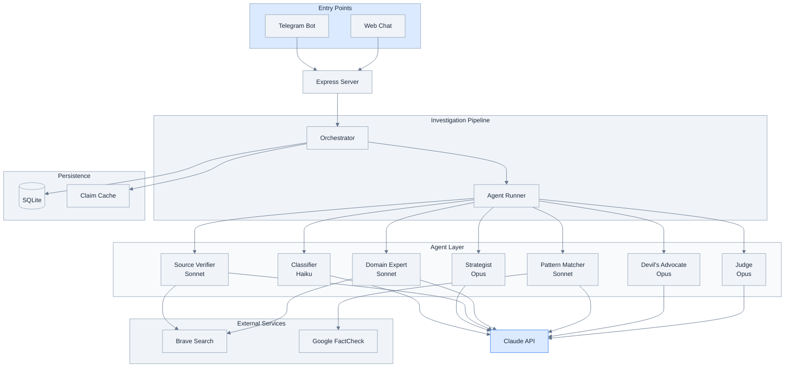
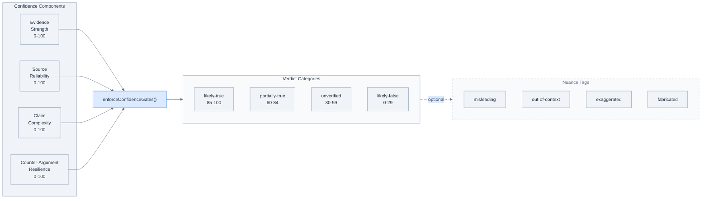
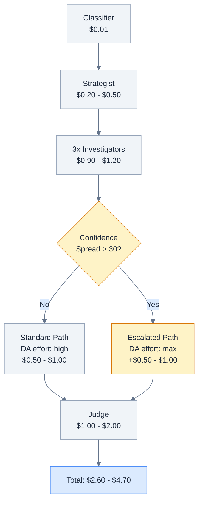

# ForwardCheck-AI Architecture Diagrams (Batch 2)

Diagrams 4-6 for the technical blog post, rendered in Anthropic engineering blog style.

---

## Diagram 4: Component Architecture

Shows the system's layered architecture from entry points through orchestration, agents, external services, and storage.

---

## Diagram 5: Confidence Gates

Confidence decomposition feeds into `enforceConfidenceGates()`, which validates category-confidence alignment and applies nuance tags.

---

## Diagram 6: Cost Model with Dynamic Escalation

Per-investigation cost flow with the dynamic escalation decision point: confidence spread > 30 triggers "max" effort path.

